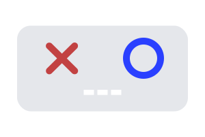

# Tic Tac AI

<div align="center">
    
</div>

Este projeto é um exercício e uma forma de aplicar o aprendizado adquirido na minha leitura do livro [Reinforcement Learning de Richard S. Sutton e Andrew G.Barto ](https://www.amazon.com/Reinforcement-Learning-Introduction-Adaptive-Computation/dp/0262039249/).

No **Tic Tac AI**, você joga contra um modelo de aprendizado por reforço, onde ele utiliza os jogos anteriores para avaliar melhores jogadas. Baseado no Processo Finito de Decisão de Markov, a cada jogada no tabuleiro, o agente recebe o estado e define a qual será sua próxima ação com base nos valores atribuídos a cada ação. Inicialmente, é utilizado a média amostral das recompensas de cada ação e são transformadas em probabilidades.

Em resumo:

```text
estado atual do tabuleiro
          ↓
busca por partidas anteriores semelhantes
          ↓
média amostral das recompensas de cada casa disponível
          ↓
conversão dos pesos em probabilidades
          ↓
escolha da próxima jogada do agente
```

O projeto reúne uma API em Python, responsável pelas regras e pela tomada de decisão, e uma interface web desenvolvida com Next.js. Por conta da complexidade dos dados, cada partida e cada jogada são armazenadas em um arquivo SQLite.explorar outras opções.

### Recompensas simples

Antes de salvar a jogada do agente, a API calcula uma recompensa imediata:

- **+0,15** para cada linha, coluna ou diagonal em que a jogada bloqueia o oponente;
- **+0,30** para cada linha, coluna ou diagonal que forma uma quase vitória;
- **+1,00** quando a jogada resulta na vitória.

Como o jogo consiste em dois jogadores, um contra o outro, as jogadas dos dois são avalidas e ao final, o total de recompensas do agente é subtraída pelo total de recompensas do jogador.

## Tecnologias utilizadas

### Backend

- Python;
- FastAPI;
- Pydantic;
- SQLModel e SQLAlchemy;
- NumPy;
- SQLite.

### Frontend

- Next.js 16;
- React 19;
- TypeScript;
- Tailwind CSS 4.

## Como executar

Você precisará ter o **Python** e o **Node.js** instalados. O backend e o frontend devem ser executados ao mesmo tempo, em terminais separados.

### 1. Inicie o backend

Na raiz do projeto, crie e ative um ambiente virtual:

```bash
python -m venv .venv
source .venv/bin/activate
```

No Windows, a ativação pode ser feita com:

```powershell
.venv\Scripts\activate
```

Instale as dependências e inicie a API:

```bash
pip install -r requirements.txt
uvicorn main:app --reload
```

A API ficará disponível em `http://localhost:8000`. O arquivo `db.sqlite` será criado automaticamente na primeira execução.

### 2. Inicie o frontend

Em outro terminal, acesse a pasta do frontend, instale as dependências e execute o servidor de desenvolvimento:

```bash
cd frontend
npm install
npm run dev
```

Agora é só abrir `http://localhost:3000` no navegador e jogar. Boa partida! 🎮
